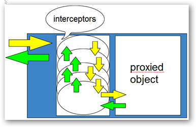

# Asynchronous interception

This article discusses several interception scenarios related to asynchrony. We'll look at these scenarios in increasing order of implementation difficulty:

 * Intercepting awaitable methods that don't produce a return value (e.g. `Task`), with and without using `async`/`await` in interceptor code

 * Intercepting awaitable methods that do produce a return value (e.g. `Task<TResult>`), with using `async`/`await` in interceptor code

 * Using `invocation.Proceed()` in combination with `async`/`await`

This article contains C# code examples that make use of the `async`/`await` keywords. Before you proceed, please make sure that you have a good understanding of how these work. They are merely "syntactic sugar" that cause the .NET compilers to rewrite an async method to a state machine with continuations. The [Async/Await FAQ by Stephen Toub](https://devblogs.microsoft.com/pfxteam/asyncawait-faq/) explains these keywords in more detail.

For brevity's sake, the examples shown in this article will focus on an interceptor's `Intercept` method. Assume that code examples are backed by the following code:


```csharp
var serviceProxy = proxyGenerator.CreateInterfaceProxyWithoutTarget<IService>(new AsyncInterceptor());

// Examples will show how interception gets triggered:
int result = await serviceProxy.GetAsync();

public interface IService
{
	Task DoAsync();
	Task<int> GetAsync(int n);
}

class AsyncInterceptor : IInterceptor
{
	// Examples will mostly focus on this method's implementation:
	public void Intercept(IInvocation invocation)
	{
		...
	}
}
```


## Intercepting awaitable methods that don't produce a return value

Intercepting awaitable methods (e.g. ones with a return type of `Task`) is fairly easy and not much different from intercepting non-awaitable methods. You'll simply have to set the intercepted invocation's return value to any valid `Task` object.


```csharp
// calling code:
await serviceProxy.DoAsync();

// interception:
public void Intercept(IInvocation invocation)
{
	invocation.ReturnValue = httpClient.PostAsync(...);
}
```


That wasn't very interesting, and in real-world scenarios you'll quickly reach a point where you'd like to use `async`/`await`. That, however, is also fairly trivial:


```csharp
// calling code:
await serviceProxy.DoAsync();

// interception:
public void Intercept(IInvocation invocation)
{
	invocation.ReturnValue = InterceptAsync(invocation);
}

private async Task InterceptAsync(IInvocation invocation)
{
	// In this method, you have the comfort of using `await`:
	var response = await httpClient.PostAsync(...);
	...
}
```


Things get more complicated once you want to return a value to the calling code. Let's look at that next!


## Intercepting awaitable methods that produce a return value

When intercepting an awaitable method that produces a return value (such as a method with a return type of `Task<TResult>`), it is important to remember that the very first `await` that gets hit by execution effectively returns to the caller right away. (The C# compiler will move the statements following the `await` into a continuation that will execute once the `await` "completes".)

In other words, the very first `await` inside your interceptor completes the proxy method interception!

DynamicProxy requires that interceptors (or the proxy target object) provide a return value for intercepted non-`void` methods. Naturally, the same requirement holds in an async scenario. Because the first `await` causes an early return to the caller, you must make sure to set the intercepted invocation's return value prior to any `await`.

We already did that at the end of the last section; let's quickly go back and take a closer look:


```csharp
// calling code:
var result = await serviceProxy.DoAsync();

// interception:
public void Intercept(IInvocation invocation)
{
	invocation.ReturnValue = InterceptAsync(invocation);
	//         ^^^^^^^^^^^^^
}

private async Task InterceptAsync(IInvocation invocation)
{
	// At this point, interception is still going on
	// as we haven't yet hit upon an `await`.

	var response = await httpClient.PostAsync(...);

	// At this point, interception has already completed!

	invocation.ReturnValue = ...;
	// ^ Any assignments to `invocation.ReturnValue` are no longer
	//   observable by the calling code, which already received its
	//   return value earlier (specifically, the `Task` produced by
	//   the C# compiler representing this asynchronous method).
	//   `invocation` is essentially a "cold", "detached", "stale",
	//   or "dead" object (pick your favourite term).
}
```


So, how would we communicate a return value back to the calling code when the intercepted method's return type is not just `Task`, but say, `Task<int>`? The following example shows how you can control the result of the task received by calling code:


```csharp
// calling code:
var result = await serviceProxy.GetAsync(41);
Assert.Equal(42, result);

// interception:
public void Intercept(IInvocation invocation)
{
	invocation.ReturnValue = InterceptAsync(invocation);
}

private async Task<int> InterceptAsync(IInvocation invocation)
{
	// We can still use `await`:
	await ...;

	// And we can simply `return` values, and the C# compiler
	// will do the rest for us:
	return (int)invocation.Arguments[0] + 1;
}
```


Unfortunately, it usually won't be *that* easy in real-world scenarios, where you cannot assume that every method that your interceptor deals with will have the exact same return type of `Task<int>`. So, instead of being able to just comfortably `return someInt;` from a `async Task<int>` method, you'll have to resort to a non-generic `Task`, a `TaskCompletionSource`, and some reflection:


```csharp
// calling code--as before:
var result = await serviceProxy.GetAsync(41);
Assert.Equal(42, result);

// interception:
public void Intercept(IInvocation invocation)
{
	var returnType = invocation.Method.ReturnType;

	// For this example, we'll just assume that we're dealing with
	// a `returnType` of `Task<TResult>`. In practice, you'd have
	// to have logic for non-`Task`, `Task`, `Task<TResult>`, and
	// any other awaitable types that you care about:
	Debug.Assert(typeof(Task).IsAssignableFrom(returnType) && returnType.IsGenericType);

	// Instantiate a `TaskCompletionSource<TResult>`, whose `Task`
	// we will return to the calling code, so that we can control
	// the result:
	var tcsType = typeof(TaskCompletionSource<>)
	              .MakeGenericType(returnType.GetGenericArguments()[0]);
	var tcs = Activator.CreateInstance(tcsType);
	invocation.ReturnValue = tcsType.GetProperty("Task").GetValue(tcs, null);

	// Because we're not in an `async` method, we cannot use `await`
	// and have the compiler generate a continuation for the code
	// following it. Let's therefore set up the continuation manually:
	InterceptAsync(invocation).ContinueWith(_ =>
	{
		// This sets the result of the task that we have previously
		// returned to the calling code, based on `invocation.ReturnValue`
		// which has been set in the (by now completed) `InterceptAsync`
		// method (see below):
		tcsType.GetMethod("SetResult").Invoke(tcs, new object[] { invocation.ReturnValue });
	});
}

private async Task InterceptAsync(IInvocation invocation)
{
	// In this method, we now have the comfort of `await`:
	var response = await httpClient.GetStringAsync(...);

	// ... and we can still set the final return value! Note that
	// the return type of this method is now `Task`, not `Task<TResult>`,
	// so we can no longer `return` a value. Instead, we use the
	// "stale" `invocation` to hold the real return value for us.
	// It will get processed in the continuation (above) when this
	// async method completes:
	invocation.ReturnValue = (int)invocation.Arguments[0] + 1;
}
```


Phew! And things get even more complex once we want to do an `invocation.Proceed()` to a succeeding interceptor or the proxy's target method. Let's look at that next!


## Using `invocation.Proceed()` in combination with `async`/`await`

Here's a quick recap about `invocation.Proceed()`: This method gets used to proceed to the next interceptor in line, or, if there is no other interceptor but a proxy target object, to that. Remember this image from the [introduction to DynamicProxy](dynamicproxy-introduction.md#interception-pipeline):



Let's get straight to the point: `Proceed()` will not do what you might expect in an async scenario! Remember that the very first `await` inside your interceptor completes interception, i.e. causes an early return to the calling code? This means that interception starts to "bubble back up" towards the calling code (i.e. along the green arrows in the above picture).

Therefore, after having `await`-ed in your interceptor, interception has completed at the position of the last green arrow. Calling `invocation.Proceed` in the continuation (i.e. after the `await`) will then simply advance to the very first interceptor again... that's likely not what you want, and can cause infinite loops and other unexpected malfunctions.


```csharp
// calling code:
await serviceProxy.DoAsync();

// interception:
public void Intercept(IInvocation invocation)
{
	invocation.ReturnValue = InterceptAsync(invocation);
}

private async Task InterceptAsync(IInvocation invocation)
{
	await ...;
	invocation.Proceed(); // will not proceed, but reenter this interceptor
	                      // or--if this isn't the first--an earlier one!
}
```


In order for you to be able to work around this problem, DynamicProxy offers another method, `invocation.CaptureProceedInfo()`, which allows you to capture the invocation's current position in the interception pipeline (i.e. where along the yellow arrows it is currently located). This method returns an object to you which you can use to continue interception from this very same location onward.

The solution to the problem demonstrated above now becomes very simple:


```csharp
// calling code--as before:
await serviceProxy.DoAsync();

// interception:
public void Intercept(IInvocation invocation)
{
	invocation.ReturnValue = InterceptAsync(invocation);
}

private async Task InterceptAsync(IInvocation invocation)
{
	// If we want to `Proceed` at any point in this method,
	// we need to capture how far in the invocation pipeline
	// we're currently located *before* we `await`:
	var proceed = invocation.CaptureProceedInfo();

	await ...;

	// At this point, interception is completed and we have
	// a "stale" invocation that has been reset to the very
	// beginning of the interception pipeline. However,
	// that doesn't mean that we cannot send it onward to the
	// remaining interceptors or to the proxy target object:
	proceed.Invoke();

	// At this point, a later interceptor might have over-
	// written `invocation.ReturnValue`. As explained earlier,
	// while the calling code will no longer observe this
	// value, we could inspect it to set our own task's
	// result (if we returned a `Task<TResult>`).
}
```


## Closing remarks

 * As you have seen, async interception is only trivial in very simple scenarios, but can get quite complex very quickly. If you don't feel comfortable writing such code yourself, look for third-party libraries that help you with async interception, for example:

   * [Castle.Core.AsyncInterceptor](https://www.nuget.org/packages/Castle.Core.AsyncInterceptor) (third-party, despite the Castle Project's package namespace)

   If you are the author of a generally useful async interception helper library, and would like to add your library to the above list, feel free to submit a PR.

 * The above examples have shown cases where a "stale" invocation object has its `ReturnValue` repeatedly set, even though only the first value might be observed by calling code. It is however possible that invocation objects are recorded somewhere, and could be inspected later on. Other parties might then observe a `ReturnValue` that does not reflect what the original caller got.

   Because of that, it might be good practice for your async interceptors to restore, at the end of interception, the `ReturnValue` to the value that actually made it back to the calling code.

 * The same recommendation&mdash;restoration to the value(s) observed by the calling code&mdash;applies to by-ref arguments that have been repeatedly overwritten using `invocation.SetArgumentValue`.
