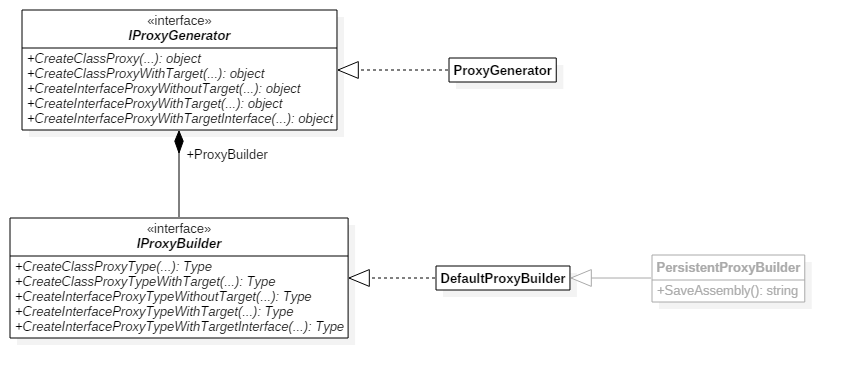
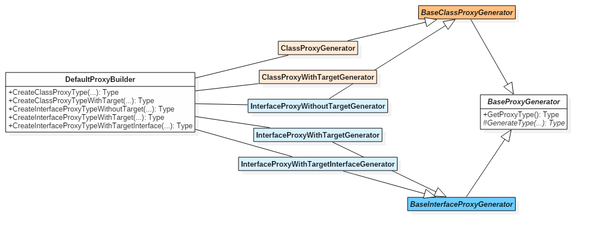
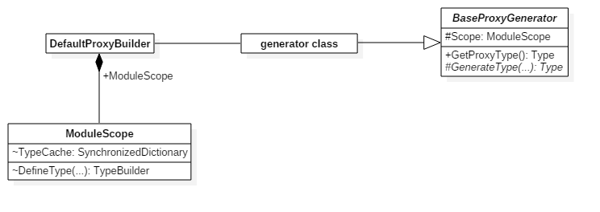

# DynamicProxy internals

This document's target audience are DynamicProxy developers. If you want to understand how DynamicProxy works under the hood, or you need a better understanding of its source code's structure, then this document is for you. If you simply want to _use_ DynamicProxy, you probably don't need to read it.

**Disclaimer:** This is work in progress. Also, be warned that this document may contain some inaccuracies, as it was initiated by a developer who came to the project fairly late in its lifetime. By that time, most of DynamicProxy's original creators (who would have been much more knowledgeable about why DynamicProxy works the way it does) have since moved on.


## Table of contents

 * [DynamicProxy from 10,000 feet](#dynamicproxy-from-10000-feet)
 * [Code generation patterns by example](#code-generation-patterns-by-example)
    * [Basic class proxy](#basic-class-proxy)
    * [Proceeding to the base class method implementation](#proceeding-to-the-base-class-method-implementation)
    * [How arguments are passed in](#how-arguments-are-passed-in)
    * [How by-ref arguments are passed back out](#how-by-ref-arguments-are-passed-back-out)
    * [Basic class proxy with target](#basic-class-proxy-with-target)
    * [How arguments are passed to the target](#how-arguments-are-passed-to-the-target)
    * [Basic interface proxy without target](#basic-interface-proxy-without-target)
    * [Basic interface proxy with target](#basic-interface-proxy-with-target)
 * [Top-down exploration of DynamicProxy's architecture](#top-down-exploration-of-dynamicproxys-architecture)
    * [1. ProxyGenerator and DefaultProxyBuilder](#1-proxygenerator-and-defaultproxybuilder)
    * [2. Proxy generator classes](#2-proxy-generator-classes)
    * [3. The proxy type cache](#3-the-proxy-type-cache)


## DynamicProxy from 10,000 feet

Whenever DynamicProxy is asked to create a proxy of type `T` (usually an interface, or an abstract class, or at the very least an inheritable class with at least one virtual, non-sealed methods), it creates a concrete implementation of that type at runtime, using `System.Reflection.Emit`. That is, it creates a dynamic assembly (`AssemblyBuilder`) and emits implementation types for `T` into it.

One of DynamicProxy's core concepts is the interception pipeline: method invocations on a proxy are converted to `IInvocation` objects, which are then passed into the proxy's interceptor pipeline. When DynamicProxy creates a proxy type, the main task consists of implementing that type's methods in just such a way.


## Code generation patterns by example

Obviously, DynamicProxy's main value lies in its interception pipeline abstraction, plus the fact that it automatically generates proxy types adhering to it.

In principle, it's entirely possible to take only the interception pipeline abstraction (`IInvocation` and `IInterceptor`), but build the proxy types manually, as source code. While that would be a very repetitive and potentially error-prone process, knowing how such proxy types might look like can benefit one's understanding of DynamicProxy's internals... which consist mostly of code that generates code (i.e. meta-programming).

For this reason (to gain a better understanding of what DynamicProxy does under the hood), we'll take a look at some of the types generated by DynamicProxy. The usual method is to create a .NET Framework application that uses DynamicProxy in some way; then to have it save its dynamically generated assembly to disk using e.g. the `PersistentProxyBuilder.SaveAssembly` method. This saved assembly can then be inspected with disassemblers such as ILDAsm, or more conveniently, with a decompiler such as [ILSpy](https://github.com/icsharpcode/ILSpy).

Each of the following subsections will start with a simple usage example of DynamicProxy, and then show the corresponding decompiled code from DynamicProxy's dynamically generated assembly.


### Basic class proxy

Say you're requesting a proxy of the following class:

```csharp
public abstract class Foo
{
    public abstract void Bar();
}

var proxy = proxyGenerator.CreateClassProxy<Foo>(new SomeInterceptor());
```

In order to fulfill this request, two types will be generated. Here is the corresponding C# code (some details are omitted for simplicity):

```csharp
using System;
using System.Reflection;

using Castle.DynamicProxy;
using Castle.DynamicProxy.Internals;

namespace Castle.Proxies
{
    public partial class FooProxy : Foo
    {
        private static MethodInfo token_Bar;

        static FooProxy()
        {
            token_Bar = (MethodInfo)MethodBase.GetMethodFromHandle(/* method handle for `Foo.Bar` */, typeof(Foo).TypeHandle);
        }

        private IInterceptor[] __interceptors;

        public FooProxy(IInterceptor[] interceptors)
            : base()
        {
            __interceptors = interceptors;
        }

        public override void Bar()
        {
            var invocation = new Foo_Bar(targetType: typeof(Foo),
                                         proxy: this,
                                         interceptors: __interceptors,
                                         proxiedMethod: token_Bar,
                                         arguments: new object[0]);
            invocation.Proceed();
        }
    }
}

namespace Castle.Proxies.Invocations
{
    public partial class Foo_Bar : InheritanceInvocation
    {
        public Foo_Bar(Type targetType, object proxy, IInterceptor[] interceptors, MethodInfo proxiedMethod, object[] arguments)
            : base(targetType, proxy, interceptors, proxiedMethod, arguments)
        {
        }

        public override void InvokeMethodOnTarget()
        {
            ThrowOnNoTarget();
        }
    }
}
```

`FooProxy.Bar` does two things: it creates an `IInvocation` that represents the intercepted method (`Foo.Bar`), then kicks off the interception pipeline by calling `invocation.Proceed`. The other generated class, `Foo_Bar`, is the backing `IInvocation` implementation used specifically by `FooProxy.Bar`. (We'll get back later to the reason why specific `IInvocation` implementations are created per proxied method.)

(Side note about `token_Bar`: This field, along with the static constructor that initializes it, isn't strictly necessary; it's a runtime performance optimization. We wouldn't want to use Reflection to look up the `MethodInfo` representing the `Foo.Bar` method upon each and every invocation. Instead, that `MethodInfo` gets looked up once and is then cached in `token_Bar`. In principle, there would be one such `token_` field per intercepted method. More on those later.)

Once these two types have been generated, DynamicProxy can instantiate a `FooProxy` object and return it as the requested `Foo` proxy:

```csharp
var proxy = new FooProxy(interceptors /* passed to `CreateClassProxy` */);
return (Foo)proxy;
```


### Proceeding to the base class method implementation

Let's change the above code example and make the `Foo.Bar` method non-abstract. This means invocations of that method on a proxy object now consider the base (proxied) class' method implementation as the target of this invocation, and one can use `invocation.Proceed` to call into `Foo.Bar`.

```diff
 public abstract class Foo
 {
-    public    abstract void Bar();
+    protected virtual  void Bar() { }
 }
```

These are the changes to the dynamically generated code:

```diff
 namespace Castle.Proxies
 {
     public partial class FooProxy : Foo
     {
         /* ... */

-        public    override void Bar()
+        protected override void Bar()
         {
             /* ... */
         }

+        public override void Bar_callback()
+        {
+            base.Bar();
+        }
     }
 }

 namespace Castle.Proxies.Invocations
 {
     public partial class Foo_Bar : InheritanceInvocation
     {
         /* ... */

         public override void InvokeMethodOnTarget()
         {
-            ThrowOnNoTarget();
+            (proxyObject as FooProxy).Bar_callback();
         }
     }
 }
```

`Foo.Bar` is `protected` and thus not directly accessible outside `Foo` or `FooProxy`, but it has to be called in the `Foo_Bar` class. To get around the accessibility restriction, DynamicProxy generates a `public` callback method in `FooProxy` that `Foo_Bar` can use as a detour into `Foo.Bar`.


### How arguments are passed in

Let's modify the original `Foo` class above by adding a parameter to its `Bar` method:

```diff
 public abstract class Foo
 {
-    public abstract void Bar();
+    public abstract void Bar(int arg);
 }
```

This will cause the following differences in the dynamically generated code:

```diff
 namespace Castle.Proxies
 {
     public partial class FooProxy : Foo
     {
         /* ... */

-        public override void Bar()
+        public override void Bar(int arg)
         {
             var invocation = new Foo_Bar(target: __target,
                                          proxy: this,
                                          interceptors: __interceptors,
                                          proxiedMethod: token_Bar,
-                                         arguments: new object[0]);
+                                         arguments: new object[1] { arg });
             invocation.Proceed();
         }
     }
 }
```

`FooProxy.Bar` now has the additional task of taking the typed arguments, and transferring them into the `IInvocation.Arguments` array.


### How by-ref arguments are passed back out

Let's turn `arg` into an `out` parameter:

```diff
 public abstract class Foo
 {
-    public abstract void Bar(    int arg);
+    public abstract void Bar(out int arg);
 }
```

This will cause the following differences in the dynamically generated code:

```diff
 namespace Castle.Proxies
 {
     public partial class FooProxy : Foo
     {
         // ...

-        public override void Bar(    int arg)
+        public override void Bar(out int arg)
         {
+            // arg = default(int);
             var invocation = new Foo_Bar(targetType: typeof(Foo),
                                          proxy: this,
                                          interceptors: __interceptors,
                                          proxiedMethod: token_Bar,
                                          arguments: new object[1] { arg });
+            try
+            {
                 invocation.Proceed();
+            }
+            finally
+            {
+                var arguments = invocation.Arguments;
+                arg = (int)arguments[0];
+            }
         }
     }
 }
```

`FooProxy.Bar` now has the additional task of copying a possibly updated `arg` value back from the `IInvocation.Arguments` array. (Incidentally, the fact that by-ref arguments are buffered in that array explains why [by-ref parameters do not get updated immediately](dynamicproxy-by-ref-parameters.md), but only when the interception process terminates.)

(Note regarding the commented-out assignment to `arg`: this statement isn't present in the generated code. It represents the automatic initialization of `out` arguments performed by the runtime, which also makes it legal to read the parameter before it has been assigned.)


### Basic class proxy with target

Consider the following changes to the first example above:

```diff
 public abstract class Foo
 {
     public abstract void Bar();
 }

+sealed class FooTarget : Foo
+{
+    public override void Bar() { /* ... */ }
+}

-var proxy = proxyGenerator.CreateClassProxy          <Foo>(                         new SomeInterceptor());
+var proxy = proxyGenerator.CreateClassProxyWithTarget<Foo>(target: new FooTarget(), new SomeInterceptor());
```

Creating a class proxy with target (instead of one without a target) will cause the following differences in the dynamically generated code:

```diff
 namespace Castle.Proxies
 {
     public partial class FooProxy : Foo
     {
         /* ... */

         private IInterceptor[] __interceptors;
+        private Foo            __target;

-        public FooProxy(            IInterceptor[] interceptors)
+        public FooProxy(Foo target, IInterceptor[] interceptors)
             : base()
         {
+            __target = target;
             __interceptors = interceptors;

         }

         public override void Bar()
         {
-            var invocation = new Foo_Bar(targetType: typeof(Foo),
+            var invocation = new Foo_Bar(target: __target,
                                          proxy: this,
                                          interceptors: __interceptors,
                                          proxiedMethod: token_Bar,
                                          arguments: new object[0]);
             invocation.Proceed();
         }
     }
 }

 namespace Castle.Proxies.Invocations
 {
-    public partial class Foo_Bar : InheritanceInvocation
+    public partial class Foo_Bar : CompositionInvocation
     {
-        public Foo_Bar(Type targetType, object proxy, IInterceptor[] interceptors, MethodInfo proxiedMethod, object[] arguments)
+        public Foo_Bar(Foo  target,     object proxy, IInterceptor[] interceptors, MethodInfo proxiedMethod, object[] arguments)
-            : base(targetType, proxy, interceptors, proxiedMethod, arguments)
+            : base(target,     proxy, interceptors, proxiedMethod, arguments)
         {
         }

         public override void InvokeMethodOnTarget()
         {
-            ThrowOnNoTarget();
+            EnsureValidTarget();
+            (target as Foo).Bar();
         }
     }
 }
```

And when instantiating the proxy, the provided target is now forwarded to `FooProxy`:

```diff
-var proxy = new FooProxy(        interceptors /* passed to `CreateClassProxy` */);
+var proxy = new FooProxy(target, interceptors /* passed to `CreateClassProxy` */);
 return (Foo)proxy;
```


### How arguments are passed to the target

You may have noticed in the last example that `InvokeMethodOnTarget` has no parameters. How does the generated code change if the `Foo.Bar` method had a parameter?

```diff
 public abstract class Foo
 {
-    public abstract void Bar();
+    public abstract void Bar(int arg);
 }
```

The generated code changes as follows:

```diff
 namespace Castle.Proxies
 {
     public partial class FooProxy : Foo
     {
         /* ... */

-        public override void Bar()
+        public override void Bar(int arg)
         {
             var invocation = new Foo_Bar(target: __target,
                                          proxy: this,
                                          interceptors: __interceptors,
                                          proxiedMethod: token_Bar,
-                                         arguments: new object[0]);
+                                         arguments: new object[1] { arg });
             invocation.Proceed();
         }
     }
 }

 namespace Castle.Proxies.Invocations
 {
     public partial class Foo_Bar : CompositionInvocation
     {
         /* ... */

         public override void InvokeMethodOnTarget()
         {
             EnsureValidTarget();
-            (target as Foo).Bar();
+            (target as Foo).Bar((int)GetArgumentValue(0));
         }
     }
 }
```

Note how the `arg` parameter's type and position are hard-coded here (as they were in `FooProxy`, in earlier examples). This is one of the main reasons why we cannot have a single generic `IInvocation` implementation that works for _all_ methods. Methods having different signatures require different invocation types (at least for proxy types that allow proceeding to a target).


### Basic interface proxy without target

What if we create an interface proxy, instead of a class proxy ([discussed above](#basic-class-proxy))?

```diff
-public abstract class Foo
+public interface      Foo
 {
-    public abstract void Bar();
+                    void Bar();
 }

-var proxy = proxyGenerator.CreateClassProxy                 <Foo>(new SomeInterceptor());
+var proxy = proxyGenerator.CreateInterfaceProxyWithoutTarget<Foo>(new SomeInterceptor());
```

These are the changes to the generated code:

```diff
 namespace Castle.Proxies
 {
     public partial class FooProxy : Foo
     {
         /* ... */

         private IInterceptor[] __interceptors;
+        private object         __target;

-        public FooProxy(IInterceptor[] interceptors)
+        public FooProxy(IInterceptor[] interceptors, object target)
-            : base()
         {
             __interceptors = interceptors;
+            __target = target;
         }

         public override void Bar()
         {
-             var invocation = new Foo_Bar                               (targetType: typeof(Foo),
+             var invocation = new InterfaceMethodWithoutTargetInvocation(target: null,
                                                                          proxy: this,
                                                                          interceptors: __interceptors,
                                                                          proxiedMethod: token_Bar,
                                                                          arguments: new object[0]);
             invocation.Proceed();
         }
     }
 }

-namespace Castle.Proxies.Invocations
-{
-    public partial class Foo_Bar : InheritanceInvocation
-    {
-        /* ... */
-    }
-}
```

A few things to note:

 * All interface proxy types have a `__target` field, but in this case, it's actually unused and not necessary. (This field could be omitted; the fact that it's there is probably related to the specific type hierarchy of the various interface proxy type generator classes, the field gets added in a common generator base class.)

 * Because interface proxies without target do not have any target to proceed to (that is, no other target object, nor base method implementations), the invocation type's implementation of `InvokeMethodOnTarget` would always be identical. This means that the invocation type does not depend on the proxied method's signature, and therefore DynamicProxy can use a standard invocation type `InterfaceMethodWithoutTargetInvocation` instead of creating a custom one.


### Basic interface proxy with target

Let's see how interface proxies with target differ from class proxies with target ([discussed above](#basic-class-proxy-with-target)):

```diff
-public abstract class Foo
+public interface      Foo
 {
-    public abstract void Bar();
+                    void Bar();
 }

+sealed class FooTarget : Foo
+{
+    public void Bar() { /* ... */ }
+}

-var proxy = proxyGenerator.CreateClassProxyWithTarget    <Foo>(target: new FooTarget(), new SomeInterceptor());
+var proxy = proxyGenerator.CreateInterfaceProxyWithTarget<Foo>(target: new FooTarget(), new SomeInterceptor());
```

These are the changes to the generated code:

```diff
 namespace Castle.Proxies
 {
     public partial class FooProxy : Foo
     {
         /* ... */

         private IInterceptor[] __interceptors;
         private Foo            __target;

-        public FooProxy(Foo target, IInterceptor[] interceptors)
+        public FooProxy(            IInterceptor[] interceptors, Foo target)
-            : base()
         {
             __target = target;
             __interceptors = interceptors;

         }

         /* ... */
     }
 }
```

The generated code is basically the same, except that the `FooProxy` constructor parameter `target` has moved to the end of the parameter list. (This is most likely due to an implementation glitch; there doesn't appear to be an obvious reason why this is be necessary.)


## Top-down exploration of DynamicProxy's architecture

The preceding main section looked at _what_ kind of types DynamicProxy generates. This section will look at _how_ it generates them.

Every request for proxy creation runs through a few distinct stages. These will be described in a top-down order in the following subsections.


### 1. ProxyGenerator and DefaultProxyBuilder

```csharp
var proxy = proxyGenerator.CreateClassProxy<Foo>(new StandardInterceptor());
```

`ProxyGenerator` does very little work itself:

 1. It asks its `ProxyBuilder` (an instance of `DefaultProxyBuilder`  by default) for a suitable proxy type.
 2. It instantiates the proxy type using `Activator.CreateInstance`, passing suitable constructor arguments.

  

As you can see in the above diagram, `IProxyBuilder` has methods corresponding to `IProxyGenerator`'s. The important difference being that the former returns proxy `Type`s, while the latter returns proxy `object`s. (`IProxyBuilder` should therefore really be called `IProxyTypeBuilder`!)


### 2. Proxy generator classes

Like `ProxyGenerator` before it, `DefaultProxyBuilder` also delegates most of the work, more specifically, to an instance of one of several proxy generator classes. Its main work lies in choosing the correct proxy generator class for the requested type of proxy.

  

The above diagram shows that every main method of `DefaultProxyBuilder` has a corresponding generator class. All of these generator classes are ultimately derived from `BaseProxyGenerator`, which can be asked for the proxy type via `GetProxyType`. The various subclasses have to implement the abstract `GenerateType` method in a manner suitable for the type of proxy they represent.

### 3. The proxy type cache

`BaseProxyGenerator` has two methods (`GetProxyType` and `GenerateType`) because not every request for a proxy type triggers dynamic type generation anew; once generated, proxy types are cached in-memory.

This proxy type cache resides in the `ModuleScope` class, which is responsible for managing the dynamic assemblies and types generated by DynamicProxy (that is, it has references to `AssemblyBuilder` and `ModuleBuilder`). Among a few other things, it provides two `internal` facilities:

 * It gives access to its `TypeCache` (which is a thread-safe dictionary referring to previously generated proxy types, indexed by some key largely derived from the `ProxyGenerationOptions` used at the time of generation).

 * It can be asked for a fresh `TypeBuilder`.

The concrete `BaseProxyGenerator` subclasses receive a reference to such a `ModuleScope` upon instantiation by `DefaultProxyBuilder`.

  


The main entry point into `BaseProxyGenerator`, i.e. the `GetProxyType` method, then does two things:

 1. It computes a type cache key for the current request (including the `ProxyGenerationOptions`) and checks with the module scope's `TypeCache` if a suitable proxy type has previously been generated. If so, it retrieves that type from the cache and returns it.

 2. If the type cache does not contain a suitable proxy type, it generates one via the `GenerateType` method (implemented by derived types), then puts the newly generated type into the cache, and returns it.

(`ModuleScope.DefineType` isn't called directly by the generator classes; the `ModuleScope` will be forwarded further down into the proxy generation type hierarchy. It is shown here merely to emphasize `ModuleScope`'s role as the central place where dynamically generated proxy types are managed.)

---

> [!NOTE]
> The remaining steps and types involved in (and bearing the brunt of) proxy type generation are still missing a description here. Unfortunately, this is also where DynamicProxy's internal architecture gets more difficult to understand. A more detailed description of these steps will hopefully be added in place of this note, but for now, it may still help to at least be aware of the different categories of types involved:
>
> 1. The various `BaseProxyGenerator` implementations will use an assortment of "contributor" types. Those are typically named `…Contributor`. Each contributor typically deals with a specific aspect of the type to be proxied. For instance, "target contributors" like `ClassProxyTargetContributor` focus on the methods of the main type to be proxied; `SerializableContributor` and its subclasses deal with those bits of a type that make it serializable; and so on.
> 2. Many of these contributors use so-called "collectors" (e.g. `ClassMembersCollector`, `InterfaceMembersCollector`, etc.) to discover methods of the type to be proxied that they are interested in. The collectors decide for each identified method which "method generator" should be used for them.
> 3. "Method generators" control the implementation of a method in the proxy type. The most important of these generator types is `MethodWithInvocationGenerator`: the name of this generator type stems from the fact that it generates methods that instantiate and use an invocation type (like you can see in the many code examples above). The two other main method generators are `MinimalisticMethodGenerator` and `ForwardingMethodGenerator`: the former gets used when a `IProxyGenerationHook` has decided that a method shouldn't be intercepted, but it still has to be implemented somehow (e.g. when proxying an interface); the latter is used to forward an intercepted call to some target object.
> 4. Then there are `InvocationTypeGenerator`s &ndash; mainly `InheritanceInvocationTypeGenerator` and `CompositionInvocationTypeGenerator` &ndash; that provide customized invocation type implementations (subclasses of `InheritanceInvocation` and `CompositionInvocation`) for use by method generators.
> 5. Finally, there are the emitter classes like `ClassEmitter`, `MethodEmitter` that are thin wrappers around `System.Reflection.Emit` builder types. There's also `CodeBuilder` and the node types in the `SimpleAST` namespace (AST stands for "abstract syntax tree") that are expression tree-like representations of the IL code to be emitted. These types are used across many of the above type categories.
