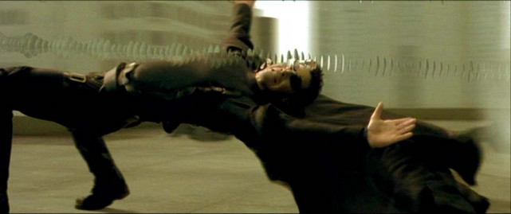

# Castle DynamicProxy - Introduction

Castle DynamicProxy is a library for generating lightweight .NET proxies on the fly at runtime. Proxy objects allow calls to members of an object to be intercepted without modifying the code of the class.

DynamicProxy differs from the proxy implementation built into the CLR which requires the proxied class to extend `MarshalByRefObject`. Extending `MashalByRefObject` to proxy an object can be too intrusive because it does not allow the class to extend another class and it does not allow transparent proxying of classes. Additionally Castle DynamicProxy provides capabilities beyond what standard CLR proxies can do, for example it lets you mix in multiple objects.

## Requirements

To use Castle DynamicProxy you need the following environment:

* one of the following runtimes installed
  * .NET version 3.5 sp1 or newer
  * Silverlight version 4 or newer
* `Castle.Core.dll` (assembly where DynamicProxy lives)

:information_source: **DynamicProxy assembly:** In previous versions (up to v2.2) DynamicProxy used to live in its own assembly `Castle.DynamicProxy.dll`. It was later moved to `Castle.Core.dll` and now no other assembly is required to use it.

## Proxies

First, what the DynamicProxy is all about and why should you care? The DynamicProxy (DP for short) is, as its name implies a framework that helps you implement the proxy object design pattern. That's the proxy part. The dynamic part, means that the actual creation of proxy type happens at runtime, and you dynamically can compose your proxy objects.

According to Wikipedia:

> A proxy, in its most general form, is a class functioning as an interface to another thing. The other thing could be anything: a network connection, a large object in memory, a file, or some other resource that is expensive or impossible to duplicate.

One way of thinking about proxies, is by the analogy to The Matrix.



Matrix as analogy for proxies (plus it's a cool picture)

I assume there's no one on the planet who hasn't seen the movie and can be spoiled here, by the details of the plot. Anyway, people in the matrix aren't the actual people ("The spoon does not exist", remember?) They're proxies to the actual people that can be... wherever. They look like ones, they behave like ones, but at the same time, they are not them actually. Another implication is the fact that different rules apply to proxies. Proxies can be what the proxied objects are, but they can be more (flying, running away from bullets, that kind of stuff). Hopefully you get the point, before I take that analogy too far. One more important thing, is that proxies ultimately delegate the behavior to the actual objects behind them (kind of like - "if you're killed in the matrix, you die in the real life as well").

The good example of a transparent proxy from programmers daily work are WCF proxies. From the perspective of the code that uses them, they're just some objects that implement an interface. They can use it, via the interface just like any other object, even though the actual implementation of the interface they're using, may be on another machine.

This is an example of a proxy, that hides the location of the actual object, from its users, and it's one way you can use proxies.

## Interception pipeline

Another way, and it's how DP is used mostly, is by adding behavior to the proxied objects. That's what the `IInterceptor` interface you'll find in DynamicProxy is for. You use interceptors to inject behavior into the proxy.


Schematic view of how DynamicProxy works.

The picture above shows schematically how that works.

* The blue rectangle is the proxy. Someone calls a method on the proxy (denoted by yellow arrow). Before the method reaches the target object it goes through a pipeline of interceptors.
* Each interceptor gets a `IInvocation` object (which is another important interface from Dynamic Proxy), that holds all the information about current request, like the `MethodInfo` of the method called, along with its parameters and returned value, reference to the proxy, as well as proxied object, and few others. Each interceptor gets its chance to inspect and change those values before the actual method on the target object is called. So for example at this stage you can log debug information about what parameters were passed to the method, or validate them. Then, the interceptor has to call `invocation.Proceed()`, to pass control further down the pipeline. An interceptor can call `Proceed` at most once, otherwise an exception is thrown.
* After last interceptor calls `Proceed`, the actual method on proxied object is invoked, and then the call travels back, up the pipeline (green arrow) giving each interceptor chance to inspect and act on, returned value, or thrown exceptions.
* Finally the proxy returns the value held by `invocation.ReturnValue` as the return value of called method.

### Interceptor example

If this was not clear enough, here's a sample interceptor, that shows how it works:

```csharp
[Serializable]
public class Interceptor : IInterceptor
{
    public void Intercept(IInvocation invocation)
    {
        Console.WriteLine("Before target call");
        try
        {
           invocation.Proceed();
        }
        catch(Exception)
        {
           Console.WriteLine("Target threw an exception!");
           throw;
        }
        finally
        {
           Console.WriteLine("After target call");
        }
    }
}
```

Hopefully, at this stage you have a pretty good idea about what DynamicProxy is, how it works, and what it's good for. In the next chapter we'll dive into some more advanced capabilities, plugging into, and influencing the process of generating proxy class.

## See also

[Kinds of proxy objects](dynamicproxy-kinds-of-proxy-objects.md)